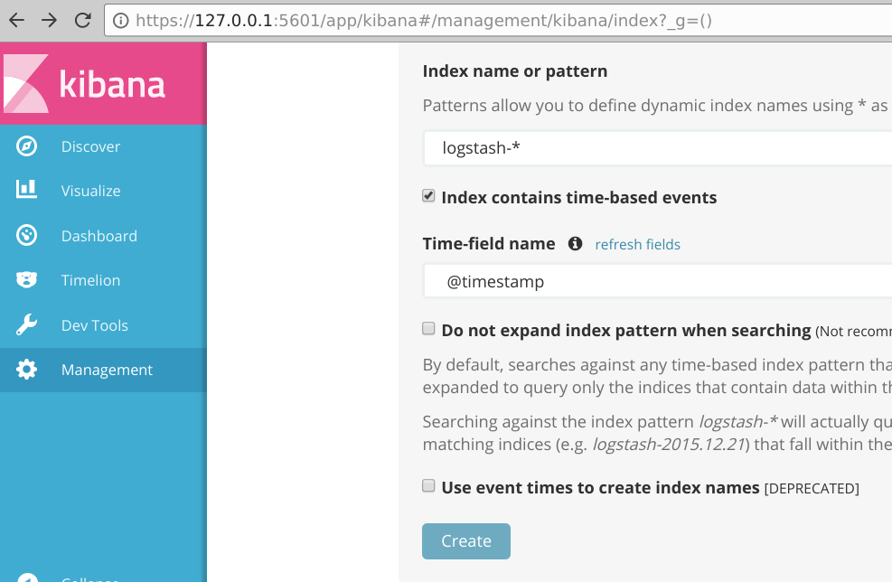
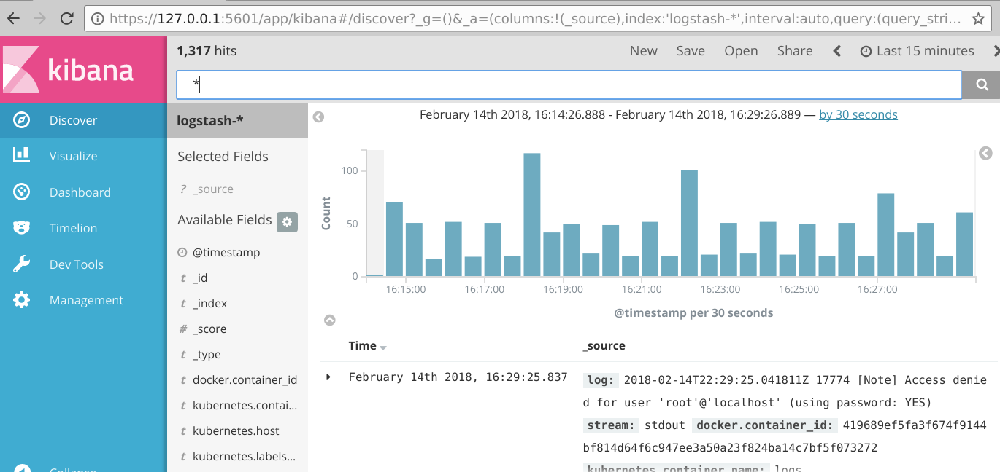

# Pivotal Container Service - Elasticsearch Fluentd Kibana

Cluster wide logging of your PKS Worker Nodes and Pods.

Kubernetes provides [documentation](https://kubernetes.io/docs/tasks/debug-application-cluster/logging-elasticsearch-kibana/) on setting up Elasticsearch as a logging target, however its not particularly easy to follow or run the examples. This repository is purpose built to set up the Elasticsearch Fluentd Kibana (EFK) stack on Kubernetes clusters built by [Pivotal Container Service (PKS)](https://pivotal.io/platform/pivotal-container-service) or its open source equivalent [Cloud Foundry Container Runtime (CFCR)](https://docs-cfcr.cfapps.io/).

## Prerequisites

* A working PKS or CFCR Kubernetes cluster
* [kubectl](https://kubernetes.io/docs/tasks/tools/install-kubectl/)

## Installing

Clone this git repo:

```console
$ git clone https://github.com/paulczar/cfcr-efk.git
$ cd cfcr-efk
```

### Operator

The [Elasticsearch Operator](https://github.com/upmc-enterprises/elasticsearch-operator) manages ES clusters on Kubernetes.

Install the elasticsearch operator in the `elasticsearch` namespace:

```console
$ kubectl create namespace elasticsearch
namespace "elasticsearch" created

$ kubectl -n elasticsearch apply -f es-operator
serviceaccount "elasticsearch-operator" created
clusterrole "elasticsearch-operator" created
clusterrolebinding "elasticsearch-operator" created
deployment "elasticsearch-operator" created
```

### Elasticsearch + Kibana

Install Elasticsearch using the Operator:

```console
$ kubectl apply -f elasticsearch
elasticsearchcluster "efk-es-cluster" created
```

Wait a few minutes and check that its running:

```console
$ kubectl -n elasticsearch get pods
NAME                                        READY     STATUS    RESTARTS   AGE
cerebro-efk-es-cluster-677ffb476c-qk28j     1/1       Running   0          3m
elasticsearch-operator-797d46bb6b-8rsc9     1/1       Running   0          7m
es-client-efk-es-cluster-5c9d99c9f6-2z2lm   1/1       Running   0          3m
es-client-efk-es-cluster-5c9d99c9f6-56tcm   1/1       Running   0          3m
es-client-efk-es-cluster-5c9d99c9f6-qxcgw   1/1       Running   0          3m
es-data-efk-es-cluster-default-0            1/1       Running   0          3m
es-data-efk-es-cluster-default-1            1/1       Running   0          3m
es-data-efk-es-cluster-default-2            1/1       Running   0          3m
es-master-efk-es-cluster-default-0          1/1       Running   0          3m
es-master-efk-es-cluster-default-1          1/1       Running   0          3m
es-master-efk-es-cluster-default-2          1/1       Running   0          3m
kibana-efk-es-cluster-5c96c8ccdc-c87g4      1/1       Running   0          3m

```

### Fluentd

Install fluentd into the `kube-system` namespace:

```console
$ kubectl apply -f fluentd/
configmap "fluentd-es-config-v0.1.4" created
serviceaccount "fluentd-es" created
clusterrole "fluentd-es" created
clusterrolebinding "fluentd-es" created
daemonset "fluentd-es-v2.0.4" created
```

The fluentd DaemonSet will only run on nodes that have the label `beta.kubernetes.io/fluentd-ds-ready=true`.  We can set this on all existing nodes like so:

```console
$ kubectl label nodes `kubectl get nodes -o jsonpath='{.items[*].metadata.name}'` beta.kubernetes.io/fluentd-ds-ready=true
node "vm-3ac9e496-f766-43be-6cfc-1e432cb80d2e" labeled
node "vm-8748d9ff-d25c-4abb-56e7-fd7e30afd6f6" labeled
node "vm-d204ead2-e57c-4919-5ed9-252268f82ff6" labeled
```

## Access Logs via Kibana

Next forward a port with `kubectl` to access kibana. You could expose it with a service or ingress, but then you'd want to secure it first which is outside the scope here.

```console
$ kubectl -n elasticsearch get pods | grep kibana
kibana-efk-es-cluster-5c96c8ccdc-c87g4      1/1       Running   0          23m

$ kubectl -n elasticsearch port-forward kibana-efk-es-cluster-5c96c8ccdc-c87g4 5601:5601
Forwarding from 127.0.0.1:5601 -> 5601
```

Open https://127.0.0.1:5601 from your browser and it should go to a setup page where you have to select your pattern `logstash-*` and time field name `@timestamp` and click `create`.



From there you can hit the Discover window and see any logs that have already been collected which should include any running Pods as well as logs from `kubelet`, `kube-proxy`, etc.


